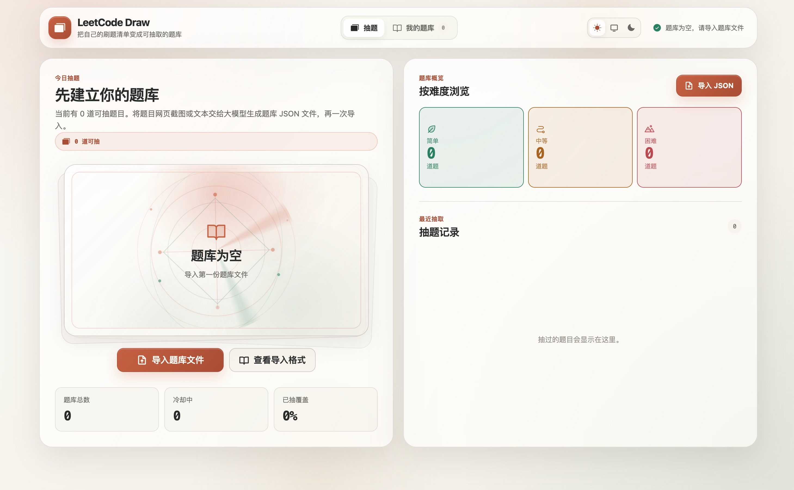
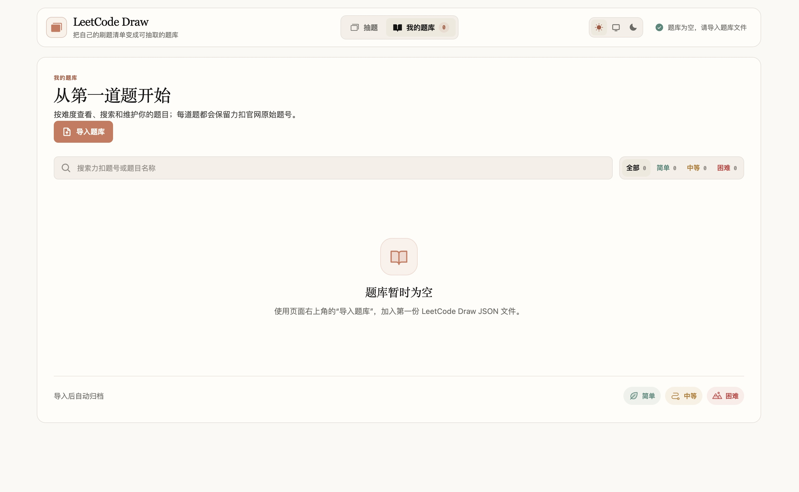
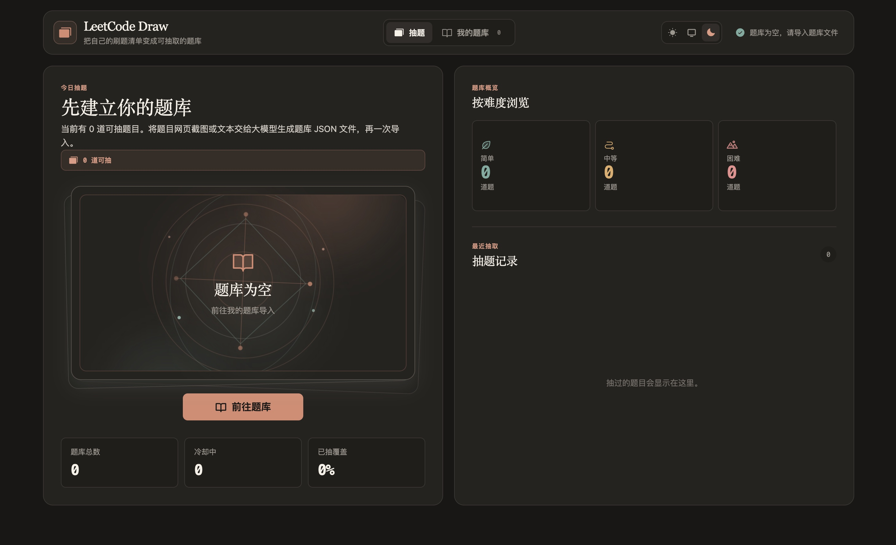
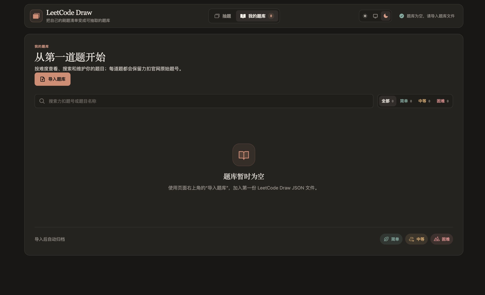

# LeetCode Draw

LeetCode Draw is a local-first macOS desktop app that turns a personal LeetCode practice list into a calm, randomly drawable question library. A new installation starts with **zero questions**. Convert a screenshot or text export into one validated JSON file, import it once, and keep the resulting library editable on your Mac.

Version 1.2.2 uses a Claude Editorial interface: warm opaque surfaces, restrained serif headings, a true warm-dark appearance, and a tarot-inspired draw animation.

## Preview

<table>
  <tr>
    <th>Light · Draw</th>
    <th>Light · Library</th>
  </tr>
  <tr>
    <td></td>
    <td></td>
  </tr>
  <tr>
    <th>Dark · Draw</th>
    <th>Dark · Library</th>
  </tr>
  <tr>
    <td></td>
    <td></td>
  </tr>
</table>

*A fresh installation: zero questions, no draw history, and one JSON import away from a personal practice library. The empty-card light gently breathes in the app and settles to a still composition when macOS Reduce Motion is enabled.*

> LeetCode Draw is an independent study tool. It is not affiliated with or endorsed by LeetCode.

## Highlights

- **Start empty.** A fresh installation has no built-in question library and nothing available to draw.
- **Import once, not one-by-one.** Import a validated JSON library created from a practice-site screenshot or text.
- **One clear import place.** The library heading owns the only import entry; the complete workflow opens in an accessible right-side drawer.
- **Keep the library editable.** Remove one imported question with inline confirmation, or clear the entire library and draw history with a separate two-step action.
- **Keep the official reference.** Every item preserves its original LeetCode problem number.
- **See difficulty immediately.** Official numbers use teal-green for 简单, amber for 中等, and red for 困难, with text labels always retained.
- **Use the whole library canvas.** Question groups fill the content width and balance into two columns on wide windows, then collapse to one column on narrower windows.
- **Draw with a cooldown.** A drawn question is held out of the pool for five days, making repeated draws more useful.
- **Review locally.** Search the library, inspect recent draws, remove an individual imported question, and open the matching LeetCode China search result when you choose to.
- **Choose your appearance.** Select Light, Dark, or System appearance; the Dock icon follows the active light or dark presentation.
- **Get useful import feedback.** Invalid or duplicate rows are reported while valid rows still import.
- **Stay local by default.** There is no account, telemetry, cloud sync, analytics service, or bundled private question library.

## Privacy by design

Your study library stays on your Mac.

- No account system, telemetry, cloud sync, analytics, or application server.
- Imported JSON is read locally through the native file picker. The library, draw history, import report, and theme setting remain in local application data.
- The app opens `leetcode.cn` only after you explicitly choose to open a question. It never sends your library or draw history there.
- This repository intentionally contains only a generic three-question sample. Do not commit a real library to a fork, issue, or pull request. Keep private exports outside the source tree or inside the ignored `private/` folder.

If you choose to give a screenshot or text list to an external model for conversion, that is a separate choice made outside LeetCode Draw. Review that service's privacy policy before sharing your material.

## Import a question library

1. Give a screenshot or text list from your practice site to a large language model.
2. Ask it to return **only** a JSON file matching the schema below. Do not ask it to add explanations or Markdown fences.
3. Save the result as a `.json` file.
4. In LeetCode Draw, open **我的题库**, choose **导入题库**, then select the JSON file from the drawer.

You can use this prompt with a model:

> Convert the supplied question list into the exact LeetCode Draw JSON format below. Preserve each official LeetCode problem number, title, and difficulty. Use only `简单`, `中等`, or `困难` for `difficulty`. Return JSON only; do not add Markdown or commentary.

```json
{
  "format": "leetcode-draw/question-library",
  "version": 1,
  "questions": [
    {
      "leetcodeId": 1,
      "name": "两数之和",
      "difficulty": "简单"
    },
    {
      "leetcodeId": 2,
      "name": "两数相加",
      "difficulty": "中等"
    },
    {
      "leetcodeId": 42,
      "name": "接雨水",
      "difficulty": "困难"
    }
  ]
}
```

### Format rules

- The root fields must be exactly `format: "leetcode-draw/question-library"` and `version: 1`.
- `questions` must be an array of question objects.
- Each question needs `leetcodeId`, `name`, and `difficulty`.
- `leetcodeId` is the official positive LeetCode problem number and is used to keep entries traceable.
- `difficulty` must be one of `简单`, `中等`, or `困难`.
- Files are limited to 2 MB. The legacy `lc` field remains readable for existing libraries, but new files should use `leetcodeId`.

The repository includes a safe, ready-to-import example: [resources/examples/leetcode-draw-example.json](resources/examples/leetcode-draw-example.json).

## Download

The latest public build is available from [GitHub Releases](https://github.com/rick-a11/leetcode-draw/releases/latest).

The release ZIP contains an Apple silicon (`arm64`) DMG plus a SHA-256 checksum file. The application is ad-hoc signed for bundle integrity checks but is **not notarized by Apple**. If your security policy requires a notarized Developer ID build, build the app locally or sign and notarize your own distribution.

## Run locally

### Requirements

- macOS
- Node.js 20 or later

```bash
npm ci
npm test
npm run build
npm run electron:dev
```

## Package a macOS app

Create a DMG after the tests and production build pass:

```bash
npm run dist
```

The result is written to `release/LeetCode-Draw-<version>-arm64.dmg`. The local build uses an ad-hoc macOS signature so the complete bundle can be integrity-checked on the build machine. It is not an Apple Developer ID or notarized distribution; maintainers distributing builds to other people should configure their own Developer ID signing and notarization.

### Install the local build safely

After `npm run dist`, install the packaged app with:

```bash
npm run install:local
```

The installer validates version `1.2.2`, bundle ID `com.leetcode-draw.desktop`, the executable, and the code signature before touching `/Applications`. It preserves the previous installation under `release/install-backups/`, installs through a temporary `.next` bundle with automatic rollback, and registers only `/Applications/LeetCode Draw.app`. Successful backups are sealed into recoverable, non-application folders so Spotlight and Launchpad do not list Electron helper bundles as duplicate apps.

## Quality checks

The current suite contains 28 tests covering the import format, duplicate and invalid-row handling, the three-question sample, cooldown behavior, theme behavior, the sole import entry, drawer focus and close behavior, successful and invalid imports, semantic difficulty numbers, individual deletion, full-library clearing, and the main draw flow. `npm run build` also checks the Electron bridge and packaged assets before a DMG is created.

## Technology

Electron, React, TypeScript, Vite, Vitest, and `electron-store`.

## License

[MIT](LICENSE)
